# DABS Project - Complete Documentation Inventory Diagram

```mermaid
graph TB
    subgraph "🗂️ DABS PROJECT - COMPLETE DOCUMENTATION INVENTORY"
        subgraph "📁 Root Level - Executive Overview"
            R1["PROJECT_SUMMARY.md<br/>🎯 Executive Summary<br/>💰 Investment & ROI Analysis<br/>📋 Implementation Plan"]
            R2["research-paper-qbo-mcp.md<br/>🔍 MCP Integration Research<br/>📊 Zapier vs n8n vs Custom<br/>🏛️ QuickBooks API Analysis"]
            R3["DABC Pricing - Inventory.code-workspace<br/>⚙️ 18 Essential Extensions<br/>❌ 23 Disabled Extensions<br/>🎯 Workspace Optimization"]
        end
        
        subgraph "📁 /docs - Technical Specifications (13 files)"
            D1["ACCEPTANCE_CRITERIA.md<br/>✅ System-Level Requirements<br/>📋 Phase-Specific Criteria<br/>🎯 Success Metrics"]
            D2["TECHNICAL_ARCHITECTURE.md<br/>🏗️ Python 3.9+ FastAPI Stack<br/>🗄️ PostgreSQL + Redis<br/>🔒 OAuth 2.0 + AES-256"]
            D3["FUNCTIONAL_REQUIREMENTS.md<br/>📋 FR-001: DABS Processing<br/>📋 FR-002: SSCS Integration<br/>📋 FR-003: QuickBooks Sync"]
            D4["NON_FUNCTIONAL_REQUIREMENTS.md<br/>⚡ Performance Specs<br/>🔒 Security Framework<br/>📊 Compliance Standards"]
            D5["DEVELOPMENT_STANDARDS.md<br/>🐍 PEP 8 Compliance<br/>🧪 90% Test Coverage<br/>📝 Documentation Requirements"]
            D6["DATA_FLOW_SPECIFICATION.md<br/>🔄 DABS → Hub → SSCS<br/>📊 QuickBooks Inventory Sync<br/>📋 Compliance Reporting"]
            D7["RISK_ASSESSMENT.md<br/>⚠️ High-Risk Items<br/>🛡️ Mitigation Strategies<br/>📅 Technical Constraints"]
            D8["TESTING_STRATEGY.md<br/>🧪 Unit/Integration/System<br/>🏢 Test Environments<br/>📊 Test Data Management"]
            D9["PRD_FRAMEWORK.md<br/>👥 Stakeholder Matrix<br/>🎯 Success Metrics<br/>⚖️ Constraints Analysis"]
            D10["dabs-architecture-diagram.md<br/>🎨 Mermaid System Diagram<br/>🔄 Data Flow Visualization<br/>📊 Component Architecture"]
            D11["EXTENSION_OPTIMIZATION_SUMMARY.md<br/>🔧 Extension Analysis<br/>📈 Performance Improvements<br/>✅ Optimization Results"]
            D12["EXTENSION_USAGE_GUIDE.md<br/>📖 275-Line Usage Manual<br/>⚙️ Configuration Details<br/>🔧 Workflow Integration"]
            D13["visual.md<br/>🎨 Additional Diagrams<br/>📊 Visual References<br/>🖼️ Supplementary Graphics"]
        end
        
        subgraph "📁 Data Files - Business Context"
            F1["DABS Price Changes.xlsx<br/>📊 1,239 SKU Dataset<br/>💰 State Pricing Data<br/>📅 Monthly Updates"]
            F2["sscs_pricing_update.csv<br/>🍾 Liquor Inventory Sample<br/>💲 Pricing Categories<br/>📈 Special Pricing Flags"]
            F3["diagram-1.png<br/>🖼️ Visual Architecture<br/>📊 System Overview<br/>🎨 Reference Diagram"]
        end
        
        subgraph "📁 System Implementation"
            S1["start_hero_system.py<br/>🚀 Streamlit Dashboard Launcher<br/>📦 Dependency Management<br/>🗂️ Auto-Directory Setup"]
            S2["scripts/enforce_structure.py<br/>🏗️ Project Structure Validation<br/>📁 Directory Enforcement<br/>⚙️ Setup Automation"]
            S3[".vscode/settings.json<br/>🐍 Python Configuration<br/>🎨 Mermaid Integration<br/>📊 CSV Processing Setup"]
        end
        
        subgraph "📁 Structure Enforcement (NEW)"
            SE1["Makefile<br/>⚙️ Build Automation<br/>🔍 Structure Checking<br/>🛠️ Fix Commands"]
            SE2["scripts/init_structure.py<br/>🏗️ Perfect Initialization<br/>📁 Directory Creation<br/>🐍 Package Setup"]
            SE3[".git/hooks/pre-commit<br/>🚫 Commit Blocker<br/>✅ Structure Validation<br/>🔒 Zero Tolerance"]
            SE4[".project-structure/STRUCTURE_RULES.json<br/>📋 Formal Specification<br/>🎯 Version 1.0.0<br/>⚖️ Compliance Rules"]
        end
    end
    
    R1 --> D1
    R2 --> D2
    R3 --> D3
    D1 --> D4
    D2 --> D5
    D3 --> D6
    D4 --> D7
    D5 --> D8
    D6 --> D9
    D7 --> D10
    D8 --> D11
    D9 --> D12
    D10 --> D13
    D11 --> F1
    D12 --> F2
    D13 --> F3
    F1 --> S1
    F2 --> S2
    F3 --> S3
    S1 --> SE1
    S2 --> SE2
    S3 --> SE3
    SE1 --> SE4
    
    style R1 fill:#90EE90
    style R2 fill:#90EE90
    style R3 fill:#90EE90
    style D1 fill:#87CEEB
    style D2 fill:#87CEEB
    style D3 fill:#87CEEB
    style D4 fill:#87CEEB
    style D5 fill:#87CEEB
    style D6 fill:#87CEEB
    style D7 fill:#87CEEB
    style D8 fill:#87CEEB
    style D9 fill:#87CEEB
    style D10 fill:#87CEEB
    style D11 fill:#87CEEB
    style D12 fill:#87CEEB
    style D13 fill:#87CEEB
    style F1 fill:#DDA0DD
    style F2 fill:#DDA0DD
    style F3 fill:#DDA0DD
    style S1 fill:#FFB6C1
    style S2 fill:#FFB6C1
    style S3 fill:#FFB6C1
    style SE1 fill:#FFD700
    style SE2 fill:#FFD700
    style SE3 fill:#FFD700
    style SE4 fill:#FFD700
```

## Summary

This diagram shows the complete inventory of all 26+ files created during Phase 1 planning:

- **Green**: Executive overview and planning documents
- **Blue**: Technical specifications suite (13 files)
- **Purple**: Business data and implementation files  
- **Pink**: Core system implementation
- **Gold**: Structure enforcement system (5 files)

**Total Coverage**: Complete business analysis, technical specifications, implementation framework, and automated structure enforcement system.
