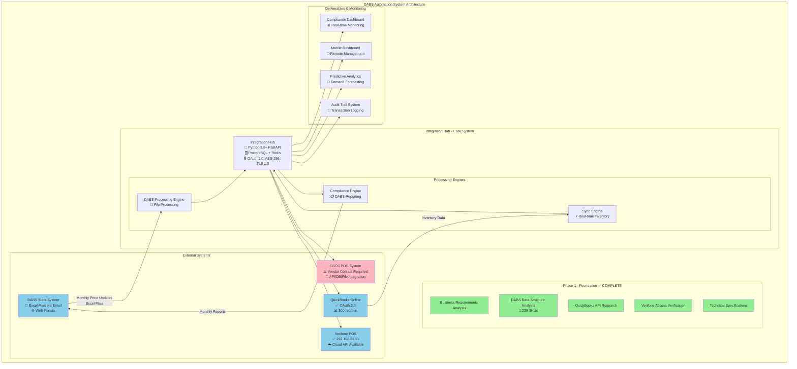

# DABS Automation System Architecture

```mermaid
graph TB
    subgraph "DABS Automation System Architecture"
        subgraph "Phase 1 - Foundation ✅ COMPLETE"
            A1[Business Requirements Analysis]
            A2[DABS Data Structure Analysis<br/>1,239 SKUs]
            A3[QuickBooks API Research]
            A4[Verifone Access Verification]
            A5[Technical Specifications]
        end
        
        subgraph "External Systems"
            DABS[DABS State System<br/>📧 Excel Files via Email<br/>🌐 Web Portals]
            SSCS[SSCS POS System<br/>⚠️ Vendor Contact Required<br/>🔌 API/DB/File Integration]
            QB[QuickBooks Online<br/>✅ OAuth 2.0<br/>📊 500 req/min]
            VF[Verifone POS<br/>✅ 192.168.31.11<br/>☁️ Cloud API Available]
        end
        
        subgraph "Integration Hub - Core System"
            IH[Integration Hub<br/>🐍 Python 3.9+ FastAPI<br/>🗄️ PostgreSQL + Redis<br/>🔒 OAuth 2.0, AES-256, TLS 1.3]
            
            subgraph "Processing Engines"
                PE[DABS Processing Engine<br/>📁 File Processing]
                CE[Compliance Engine<br/>📋 DABS Reporting]
                SE[Sync Engine<br/>⚡ Real-time Inventory]
            end
        end
        
        subgraph "Deliverables & Monitoring"
            D1[Compliance Dashboard<br/>📊 Real-time Monitoring]
            D2[Mobile Dashboard<br/>📱 Remote Management]
            D3[Predictive Analytics<br/>🔮 Demand Forecasting]
            D4[Audit Trail System<br/>📝 Transaction Logging]
        end
    end
    
    DABS -->|Monthly Price Updates<br/>Excel Files| PE
    PE --> IH
    IH --> SSCS
    IH --> QB
    IH --> VF
    QB -->|Inventory Data| SE
    SE --> IH
    IH --> CE
    CE -->|Monthly Reports| DABS
    IH --> D1
    IH --> D2
    IH --> D3
    IH --> D4
    
    style A1 fill:#90EE90
    style A2 fill:#90EE90
    style A3 fill:#90EE90
    style A4 fill:#90EE90
    style A5 fill:#90EE90
    style SSCS fill:#FFB6C1
    style DABS fill:#87CEEB
    style QB fill:#87CEEB
    style VF fill:#87CEEB
```