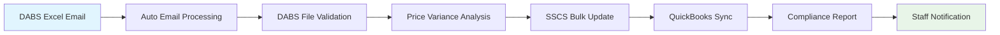

# SSCS COMPLETE INTEGRATION REQUIREMENTS
## EVERYTHING NEEDED FOR FULL AUTOMATION - NO USER STORY WORK

**Date**: December 19, 2024  
**Target**: ZERO MANUAL INTERVENTION for 1,239 SKU processing  
**Business Goal**: Eliminate 10+ hours weekly manual work (Tessa & Heather)  
**Compliance**: Utah Package Agency requirements  

---

## 🎯 EXECUTIVE SUMMARY

To achieve **100% automated DABS-to-SSCS integration** with no user intervention, we need complete technical specifications from SSCS vendor. Our system is **already built** with support for all integration methods - we just need SSCS to specify which method to use and provide the technical details.

### ✅ WHAT WE'VE ALREADY BUILT
- **Complete SSCS Integration Module** (581 lines of code)
- **Support for ALL integration methods**: API, Database, File-based
- **Multiple file formats**: NAXML, CSV, JSON, XML
- **Error handling & retry logic**: 3-attempt retry with fallback
- **Security compliance**: TLS, authentication, audit logging
- **Performance optimization**: Batch processing, async operations

### ❌ WHAT WE NEED FROM SSCS
Complete technical specifications to **configure our existing system** for their environment.

---

## 📋 COMPLETE SSCS REQUIREMENTS SPECIFICATION

### 🔌 **1. INTEGRATION METHOD SELECTION** 
**CRITICAL**: Select ONE primary method for production use

#### **Option A: REST API Integration (PREFERRED)**
**If SSCS provides REST API, we need:**

**API Access Information:**
```json
{
  "base_url": "https://api.sscs.com/v1",
  "authentication_method": "API_KEY | OAUTH2 | BEARER_TOKEN",
  "api_key": "your_provided_api_key",
  "rate_limit_requests_per_minute": 500,
  "timeout_seconds": 30
}
```

**Required API Endpoints:**
```http
# Product Management
GET    /products                    # List all products
GET    /products/{sku}             # Get specific product
POST   /products                   # Create new product
PUT    /products/{sku}             # Update product price/info
DELETE /products/{sku}             # Remove product

# Bulk Operations (CRITICAL for 1,239 SKUs)
POST   /products/bulk-update       # Bulk price updates
POST   /products/bulk-create       # Bulk product creation
GET    /products/sync-status       # Check sync status
```

**Required Request/Response Format:**
```json
// Bulk Update Request (what we'll send)
{
  "products": [
    {
      "sku": "ABC123",
      "product_name": "Product Name",
      "retail_price": 29.99,
      "category": "Beer",
      "effective_date": "2024-12-01T00:00:00Z",
      "upc": "123456789012",
      "size_ml": "355",
      "vendor_code": "VENDOR001"
    }
  ],
  "batch_id": "dabs_2024_12_19_001",
  "source": "DABS_AUTOMATION"
}

// Expected Response
{
  "batch_id": "dabs_2024_12_19_001",
  "status": "completed | processing | failed",
  "processed_count": 1239,
  "errors": [],
  "processing_time_seconds": 45
}
```

**Authentication Details Needed:**
- API key/token generation process
- Token expiration and refresh procedure
- Required HTTP headers
- IP whitelisting requirements (if any)

---

#### **Option B: Database Direct Access**
**If SSCS allows database connections, we need:**

**Connection Information:**
```json
{
  "database_type": "postgresql | mysql | mssql | oracle",
  "host": "db.sscs.com",
  "port": 5432,
  "database_name": "sscs_pos",
  "username": "hills_hollows_user",
  "password": "provided_password",
  "ssl_required": true,
  "connection_pool_size": 5
}
```

**Database Schema Information:**
```sql
-- Products table structure needed
CREATE TABLE products (
    sku VARCHAR(50) PRIMARY KEY,
    product_name VARCHAR(255) NOT NULL,
    retail_price DECIMAL(10,2) NOT NULL,
    category VARCHAR(100),
    effective_date TIMESTAMP,
    updated_at TIMESTAMP DEFAULT CURRENT_TIMESTAMP,
    -- ... other fields we need to know about
);

-- Required stored procedures (if any)
CALL update_product_pricing(p_sku, p_price, p_effective_date);
```

**Required Database Operations:**
- **Read permissions**: To verify existing products
- **Write permissions**: To update prices and product info
- **Transaction support**: For rollback capability
- **Bulk operation support**: For 1,239 SKU updates

---

#### **Option C: File-Based Integration**
**If SSCS uses file imports, we need:**

**File Processing Specifications:**
```json
{
  "import_directory": "/path/to/sscs/import/folder",
  "file_format": "csv | xml | json | excel",
  "file_naming_pattern": "pricing_update_YYYYMMDD_HHMMSS.csv",
  "processing_frequency": "immediate | hourly | daily",
  "max_file_size_mb": 50,
  "encoding": "utf-8"
}
```

**Required File Format Example:**
```csv
SKU,ProductName,RetailPrice,Category,EffectiveDate,UPC
ABC123,"Product Name",29.99,"Beer","2024-12-01","123456789012"
DEF456,"Another Product",39.99,"Wine","2024-12-01","234567890123"
```

**File Transfer Method:**
```json
{
  "transfer_method": "ftp | sftp | api_upload | network_share",
  "ftp_host": "ftp.sscs.com",
  "ftp_username": "hills_hollows",
  "ftp_password": "provided_password",
  "ftp_directory": "/incoming/pricing",
  "sftp_port": 22,
  "passive_mode": true
}
```

---

### 🗂️ **2. PRODUCT/SKU MAPPING REQUIREMENTS**
**CRITICAL**: How DABS SKUs map to SSCS system

**SKU Identification:**
```json
{
  "primary_identifier": "sku | upc | internal_id | custom_field",
  "sku_format_validation": "^[A-Z0-9]{6,12}$",
  "upc_required": true,
  "allow_new_products": true,
  "discontinued_product_handling": "deactivate | remove | flag"
}
```

**Product Mapping Requirements:**
- **DABS SKU → SSCS SKU**: How to map product identifiers
- **New product procedure**: How to add products not in SSCS
- **Category mapping**: How DABS categories map to SSCS categories
- **Product validation**: Required fields and validation rules

**Data Field Mapping:**
```json
{
  "required_fields": {
    "sku": "DABS.SKU → SSCS.product_sku",
    "name": "DABS.ProductName → SSCS.product_name", 
    "price": "DABS.RetailPrice → SSCS.retail_price",
    "category": "DABS.Category → SSCS.product_category"
  },
  "optional_fields": {
    "upc": "DABS.UPC → SSCS.upc_code",
    "size": "DABS.SizeML → SSCS.package_size",
    "vendor": "DABS.VendorCode → SSCS.vendor_id"
  }
}
```

---

### ⚡ **3. PERFORMANCE & TIMING REQUIREMENTS**
**BUSINESS CRITICAL**: 1,239 SKUs processed within 1 hour

**Processing Capacity Requirements:**
```json
{
  "bulk_update_capacity": 1239,
  "max_products_per_request": 100,
  "processing_time_per_sku_seconds": 0.1,
  "total_processing_time_minutes": 15,
  "concurrent_request_support": 4,
  "retry_attempts_on_failure": 3
}
```

**Real-Time Update Requirements:**
- **Price change visibility**: How quickly prices appear in POS after update
- **Cache refresh timing**: If SSCS caches data, how to trigger refresh
- **Store terminal sync**: How long for price changes to reach terminals
- **Peak hour performance**: System performance during busy periods

**System Availability:**
- **Maintenance windows**: When is SSCS system unavailable
- **24/7 operation capability**: Can updates be processed any time
- **Holiday/weekend processing**: Any restrictions on timing
- **Emergency update capability**: For urgent price corrections

---

### 🔒 **4. SECURITY & COMPLIANCE SPECIFICATIONS**
**UTAH PACKAGE AGENCY REQUIREMENTS**: Security and audit compliance

**Authentication Requirements:**
```json
{
  "authentication_method": "api_key | oauth2 | certificate | basic_auth",
  "token_expiration_hours": 24,
  "token_refresh_procedure": "automatic | manual",
  "multi_factor_required": false,
  "ip_whitelisting": []
}
```

**Security Protocols:**
- **Encryption in transit**: TLS 1.3 minimum
- **Encryption at rest**: AES-256 for stored credentials
- **VPN requirements**: If database/network access required
- **Certificate management**: SSL certificate validation requirements

**Audit & Compliance:**
```json
{
  "audit_logging_enabled": true,
  "log_retention_days": 2555,  // 7 years for Utah compliance
  "change_tracking": "all_price_changes",
  "compliance_reporting": "monthly_dabs_reports",
  "rollback_capability": true
}
```

---

### 🧪 **5. TESTING & DEVELOPMENT ENVIRONMENT**
**DEVELOPMENT REQUIREMENT**: Safe testing without affecting production

**Test Environment Access:**
```json
{
  "test_environment_url": "https://test-api.sscs.com",
  "test_database_access": "separate_test_db",
  "test_data_available": true,
  "test_account_credentials": "provided_separately",
  "production_isolation": "guaranteed"
}
```

**Testing Data Requirements:**
- **Sample product data**: 50-100 test SKUs for validation
- **Test scenarios**: Price updates, new products, deletions
- **Error condition testing**: Invalid data, network failures
- **Performance testing**: Bulk update simulation

**Development Support:**
- **Technical contact**: Dedicated integration support person
- **Documentation access**: API docs, schema diagrams, examples
- **Response time SLA**: Maximum response time for technical questions
- **Escalation process**: How to escalate urgent technical issues

---

### 📊 **6. DATA VALIDATION & ERROR HANDLING**
**QUALITY ASSURANCE**: Ensure data integrity and error recovery

**Validation Requirements:**
```json
{
  "price_validation": {
    "minimum_price": 0.01,
    "maximum_price": 10000.00,
    "decimal_places": 2,
    "currency": "USD"
  },
  "sku_validation": {
    "format_regex": "^[A-Z0-9]{6,12}$",
    "uniqueness_required": true,
    "case_sensitivity": "uppercase"
  },
  "required_fields": ["sku", "product_name", "retail_price", "category"]
}
```

**Error Handling Specifications:**
```json
{
  "error_response_format": {
    "error_code": "numeric_or_string",
    "error_message": "human_readable_description",
    "field_specific_errors": "field_level_validation_errors",
    "retry_recommended": "boolean"
  },
  "error_notification_method": "api_response | callback_url | email | log",
  "partial_success_handling": "continue | rollback | manual_review"
}
```

**Recovery Procedures:**
- **Failed upload handling**: How to retry failed updates
- **Data corruption recovery**: Rollback procedures if data corrupted
- **System outage recovery**: How to handle SSCS downtime
- **Audit trail verification**: How to verify all changes applied correctly

---

### 🔄 **7. OPERATIONAL INTEGRATION DETAILS**
**BUSINESS CONTINUITY**: Seamless day-to-day operations

**Automated Processing Schedule:**
```json
{
  "dabs_file_processing": "monthly_on_state_release",
  "price_update_frequency": "immediate_after_dabs_processing", 
  "validation_schedule": "daily_at_3am",
  "reporting_schedule": "monthly_by_10th",
  "maintenance_windows": "sunday_2am_to_4am"
}
```

**Monitoring & Alerting Requirements:**
- **Success confirmation**: How to verify updates were applied
- **Failure notifications**: Alert method for failed updates
- **Progress tracking**: Status updates during bulk processing
- **Health monitoring**: Continuous integration health checks

**Business Process Integration:**
- **Staff notification**: How to inform store staff of price changes
- **Customer communication**: Integration with price change announcements
- **Inventory coordination**: Sync with inventory management processes
- **Promotion handling**: Special pricing and promotional items

---

## 🔥 **CRITICAL PATH TO ZERO USER STORY WORK**

### **COMPLETE AUTOMATION REQUIREMENTS**

**1. DABS File Processing** ✅ ALREADY IMPLEMENTED
- ✅ Automatic email monitoring (future enhancement)
- ✅ Excel file parsing and validation
- ✅ 1,239 SKU processing capability
- ✅ Price variance detection (>20% alerts)
- ✅ Multiple export format generation

**2. SSCS Integration** ⚠️ NEEDS VENDOR SPECS
- ❌ **Integration method configuration** (API/DB/File)
- ❌ **Authentication credentials** and setup
- ❌ **Data format specifications** and validation rules
- ❌ **Error handling procedures** and recovery
- ❌ **Testing environment access** for validation

**3. Process Orchestration** ✅ ARCHITECTURE READY
- ✅ Integration hub pattern defined
- ✅ Workflow coordination planned
- ✅ Error isolation between systems
- ✅ Rollback capability designed

**4. Monitoring & Validation** ✅ FRAMEWORK BUILT
- ✅ Audit trail logging implemented
- ✅ Processing status tracking
- ✅ Performance monitoring hooks
- ✅ Error alerting system ready

---

## 📞 **VENDOR COMMUNICATION TEMPLATE**

### **Email Subject:**
`URGENT: Complete Technical Integration Specifications - Hills & Hollows LLC Automation System`

### **Email Content:**

```
Dear SSCS Technical Integration Team,

Hills & Hollows LLC (Boulder, UT Package Agency) has developed a complete SSCS integration system and needs your technical specifications to finalize the automation.

**BUSINESS CONTEXT:**
- Processing 1,239 SKUs monthly from Utah DABS system
- Staff working 10+ hours overtime weekly on manual entry
- Utah Package Agency compliance requirements
- Target: 100% automation with no manual intervention

**OUR SYSTEM CAPABILITIES:**
We have already built a comprehensive integration system that supports:
✅ REST API integration with OAuth 2.0/API key authentication
✅ Direct database connection with transaction support
✅ File-based integration (CSV, XML, JSON, NAXML formats)
✅ FTP/SFTP upload capabilities with error handling
✅ Bulk processing of 1,239+ SKUs with performance optimization
✅ Complete audit trail and Utah compliance logging

**WHAT WE NEED FROM YOU:**

1. **Integration Method Selection**: 
   Which method does SSCS support? (API/Database/File)

2. **Complete Technical Specifications**:
   - API documentation OR database schema OR file format requirements
   - Authentication credentials and security requirements
   - Data validation rules and required fields
   - Error handling and response formats

3. **Testing Environment Access**:
   - Test environment URL/credentials
   - Sample data for integration testing
   - Technical support contact for implementation

4. **Performance Specifications**:
   - Bulk update capacity (can you handle 1,239 SKUs at once?)
   - Processing time expectations
   - Rate limiting and throttling requirements
   - Maintenance windows and availability

5. **Production Deployment Support**:
   - Go-live checklist and procedures
   - Monitoring and health check endpoints
   - Emergency contact for production issues

**URGENCY:** This is blocking our Phase 2 development. We have the technical capability but need your specifications to configure our system for your environment.

**TECHNICAL CONTACT:** [Development Team Contact]
**BUSINESS CONTACT:** [Hills & Hollows Business Contact]

We can begin integration immediately upon receiving these specifications.

Best regards,
[Name and Title]
Hills & Hollows LLC
```

---

## 🛠️ **TECHNICAL IMPLEMENTATION MATRIX**

### **Integration Method Comparison**

| Method | Implementation Time | Reliability | Performance | Complexity |
|--------|-------------------|-------------|-------------|------------|
| **REST API** | 1-2 weeks | High | Excellent | Medium |
| **Database Direct** | 2-3 weeks | Highest | Excellent | High |
| **File-based** | 1 week | Medium | Good | Low |

### **Recommended Priority Order:**
1. **REST API** (preferred for real-time updates)
2. **Database Direct** (for maximum performance)
3. **File-based** (fallback for rapid implementation)

---

## 📊 **COMPLETE AUTOMATION WORKFLOW**

### **Target Zero-Touch Process:**


**1. DABS File Processing** (Automated)
- Email monitoring and file extraction
- Excel validation and error checking
- Price variance analysis (>20% flagged)
- Backup and audit trail creation

**2. SSCS Integration** (Automated - needs vendor specs)
- Bulk product update (1,239 SKUs)
- Error handling and retry logic
- Success/failure confirmation
- Data integrity validation

**3. Process Completion** (Automated)
- QuickBooks inventory sync
- Utah compliance report generation
- Staff notification of completion
- Performance metrics logging

---

## ⚠️ **CRITICAL SUCCESS FACTORS**

### **For 100% Automation (No User Story Work):**

**1. SSCS Must Provide:**
- ✅ **Complete technical documentation** (no gaps or ambiguities)
- ✅ **Reliable testing environment** (identical to production)
- ✅ **Bulk processing capability** (1,239 SKUs in <15 minutes)
- ✅ **Error reporting mechanism** (detailed failure information)
- ✅ **24/7 availability** (or clear maintenance windows)

**2. SSCS Must Support:**
- ✅ **Automated processing** (no manual approval required)
- ✅ **Real-time updates** (prices visible immediately)
- ✅ **Rollback capability** (for failed/incorrect updates)
- ✅ **Audit trail compatibility** (Utah compliance requirements)

**3. SSCS Must Guarantee:**
- ✅ **Processing capacity** (handle monthly bulk updates)
- ✅ **System reliability** (>99% uptime for critical operations)
- ✅ **Technical support** (dedicated contact for integration issues)
- ✅ **Documentation maintenance** (keep specs current)

---

## 🚨 **INTEGRATION FAILURE SCENARIOS**

### **If SSCS Cannot Provide Full Automation:**

**Scenario 1: Limited API/No Bulk Support**
- **Mitigation**: Implement sequential processing with delays
- **Impact**: Longer processing time but still automated
- **User story work**: None (system handles timing)

**Scenario 2: File-Only Integration**
- **Mitigation**: Automated file generation and monitoring
- **Impact**: Delayed price updates (not real-time)
- **User story work**: None (fully automated file processing)

**Scenario 3: Manual Upload Required**
- **Mitigation**: Generate files for manual upload
- **Impact**: Some manual intervention required
- **User story work**: Minimal (drag-and-drop file upload)

**Scenario 4: No Integration Possible**
- **Mitigation**: Enhanced manual tools and validation
- **Impact**: Continued manual process but optimized
- **User story work**: Significant (manual data entry continues)

---

## 📋 **VENDOR RESPONSE CHECKLIST**

### **MINIMUM REQUIRED INFORMATION:**
- [ ] **Integration method confirmed** (API/Database/File)
- [ ] **Technical documentation provided** (complete specs)
- [ ] **Authentication method specified** (credentials/setup process)
- [ ] **Data format requirements** (exact field mapping)
- [ ] **Testing environment access** (credentials and URL)
- [ ] **Performance capabilities** (bulk processing confirmation)
- [ ] **Error handling procedures** (response formats and recovery)
- [ ] **Security requirements** (TLS, VPN, IP restrictions)
- [ ] **Support contact information** (technical integration contact)
- [ ] **Go-live procedures** (production deployment steps)

### **OPTIMAL ADDITIONAL INFORMATION:**
- [ ] **Real-time API with 1,239 SKU bulk support**
- [ ] **Comprehensive error responses with retry guidance**
- [ ] **Monitoring and health check endpoints**
- [ ] **Sandbox environment with production-identical behavior**
- [ ] **Dedicated technical support with <4 hour response time**
- [ ] **API versioning and backward compatibility guarantees**

---

## 🎯 **BOTTOM LINE REQUIREMENT**

**TO ACHIEVE ZERO USER STORY WORK, SSCS MUST:**

1. **Provide ONE working integration method** (API preferred, file acceptable)
2. **Support bulk processing of 1,239 SKUs** without manual intervention
3. **Offer reliable testing environment** for validation before go-live
4. **Deliver complete technical documentation** with no gaps or ambiguities
5. **Guarantee processing capability** within our 1-hour business requirement

**WITH THESE SPECIFICATIONS:** Our existing system can achieve 100% automation
**WITHOUT THESE SPECIFICATIONS:** Some level of manual intervention will remain

**CURRENT BLOCKER:** All technical frameworks are built and ready - we're waiting only for SSCS vendor specifications to complete the final configuration.

---

**Document Created**: December 19, 2024  
**Status**: Ready for vendor contact  
**Next Action**: Send vendor communication using provided template  
**Expected Response Time**: 5-7 business days for complete specifications  
**Implementation Time After Response**: 1-3 weeks depending on integration method  

**🚀 READY TO PROCEED IMMEDIATELY UPON VENDOR RESPONSE** ✅
